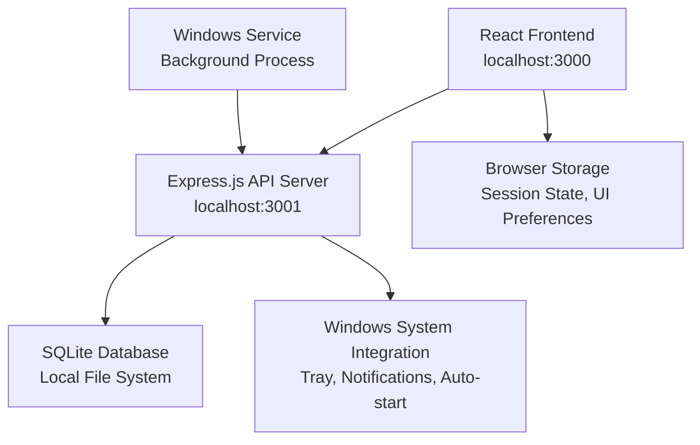
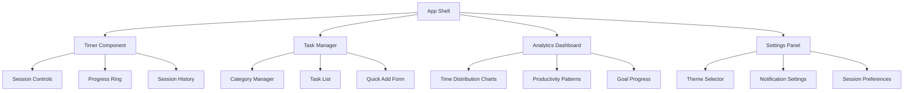

# Design Document

## Overview

The Local Task Tracking App is architected as a high-performance localhost web application optimized for Windows. The system uses a React frontend communicating with an Express.js backend, both running on the user's local machine. Data is stored in SQLite for maximum performance and privacy. The design prioritizes speed, simplicity, and user focus while providing comprehensive productivity tracking capabilities.

## Architecture

### System Architecture



### Technology Stack

**Frontend Layer:**
- React 18+ with TypeScript for type safety and performance
- Zustand for lightweight state management (2KB vs Redux 47KB)
- Tailwind CSS for utility-first styling matching UI.png design
- Recharts for analytics visualization
- Lucide React for tree-shakeable icons
- Day.js for date/time operations (2KB vs Moment.js 67KB)

**Backend Layer:**
- Express.js server for API endpoints
- better-sqlite3 for synchronous, high-performance database operations
- node-windows for Windows service integration
- Custom middleware for request logging and error handling

**Data Layer:**
- SQLite database with optimized indexes
- Connection pooling for performance
- Automatic backup and recovery mechanisms

### Deployment Architecture

The application packages as a single Windows executable that:
1. Starts an Express.js server on localhost:3001 (with automatic port detection)
2. Opens the default browser to localhost:3000 (React app)
3. Runs as a Windows service for auto-start capability
4. Minimizes to system tray instead of closing

## Components and Interfaces

### Core Components Architecture



### Component Specifications

**Timer Component:**
- Large, prominent countdown display (minimum 120px font size)
- Circular progress ring with smooth animations
- Session type selector with visual indicators
- One-click start/pause/stop controls
- Background color changes based on session type (work/break)

**Task Manager:**
- Category-based organization with color coding
- Drag-and-drop task reordering within categories
- Quick task creation with keyboard shortcuts (Ctrl+N)
- Task filtering by status, category, and due date
- Bulk operations for task management

**Analytics Dashboard:**
- Real-time charts updating every session completion
- Time distribution pie charts by category
- Weekly/monthly trend lines
- Productivity heatmap showing optimal focus times
- Goal progress bars with visual milestones

### API Interface Design

**RESTful API Endpoints:**

```typescript
// Session Management
POST /api/sessions/start
PUT /api/sessions/:id/pause
PUT /api/sessions/:id/resume
POST /api/sessions/:id/complete
GET /api/sessions/active

// Task Management
GET /api/tasks?category=:id&status=:status
POST /api/tasks
PUT /api/tasks/:id
DELETE /api/tasks/:id

// Category Management
GET /api/categories
POST /api/categories
PUT /api/categories/:id
DELETE /api/categories/:id

// Analytics
GET /api/analytics/time-distribution?period=:period
GET /api/analytics/productivity-patterns
GET /api/analytics/streaks
GET /api/analytics/goals-progress

// Settings
GET /api/settings
PUT /api/settings/:key
```

## Data Models

### Database Schema

```sql
-- Sessions table for time tracking
CREATE TABLE sessions (
    id INTEGER PRIMARY KEY AUTOINCREMENT,
    task_id INTEGER,
    category_id INTEGER,
    session_type TEXT NOT NULL, -- 'deep_work', 'quick_task', 'break', 'custom'
    start_time DATETIME NOT NULL,
    end_time DATETIME,
    planned_duration INTEGER NOT NULL, -- in minutes
    actual_duration INTEGER, -- in minutes
    quality_rating INTEGER, -- 1-5 scale
    notes TEXT,
    completed BOOLEAN DEFAULT FALSE,
    created_at DATETIME DEFAULT CURRENT_TIMESTAMP,
    FOREIGN KEY (task_id) REFERENCES tasks(id),
    FOREIGN KEY (category_id) REFERENCES categories(id)
);

-- Tasks table
CREATE TABLE tasks (
    id INTEGER PRIMARY KEY AUTOINCREMENT,
    title TEXT NOT NULL,
    description TEXT,
    category_id INTEGER NOT NULL,
    estimated_duration INTEGER, -- in minutes
    actual_duration INTEGER DEFAULT 0, -- accumulated from sessions
    priority TEXT DEFAULT 'medium', -- 'low', 'medium', 'high'
    status TEXT DEFAULT 'active', -- 'active', 'completed', 'archived'
    due_date DATETIME,
    completed_at DATETIME,
    created_at DATETIME DEFAULT CURRENT_TIMESTAMP,
    updated_at DATETIME DEFAULT CURRENT_TIMESTAMP,
    FOREIGN KEY (category_id) REFERENCES categories(id)
);

-- Categories table
CREATE TABLE categories (
    id INTEGER PRIMARY KEY AUTOINCREMENT,
    name TEXT NOT NULL UNIQUE,
    color TEXT NOT NULL, -- hex color code
    icon TEXT, -- lucide icon name
    description TEXT,
    weekly_goal INTEGER DEFAULT 0, -- target minutes per week
    created_at DATETIME DEFAULT CURRENT_TIMESTAMP
);

-- User settings table
CREATE TABLE user_settings (
    key TEXT PRIMARY KEY,
    value TEXT NOT NULL,
    updated_at DATETIME DEFAULT CURRENT_TIMESTAMP
);

-- Daily streaks and habits
CREATE TABLE daily_stats (
    date DATE PRIMARY KEY,
    total_focus_time INTEGER DEFAULT 0, -- in minutes
    sessions_completed INTEGER DEFAULT 0,
    focus_score REAL DEFAULT 0.0, -- calculated score 0-100
    streak_day BOOLEAN DEFAULT FALSE,
    created_at DATETIME DEFAULT CURRENT_TIMESTAMP
);

-- Performance indexes
CREATE INDEX idx_sessions_start_time ON sessions(start_time);
CREATE INDEX idx_sessions_task_id ON sessions(task_id);
CREATE INDEX idx_sessions_category_id ON sessions(category_id);
CREATE INDEX idx_tasks_category_id ON tasks(category_id);
CREATE INDEX idx_tasks_status ON tasks(status);
CREATE INDEX idx_daily_stats_date ON daily_stats(date);
```

### TypeScript Interfaces

```typescript
interface Session {
  id: number;
  taskId?: number;
  categoryId: number;
  sessionType: 'deep_work' | 'quick_task' | 'break' | 'custom';
  startTime: Date;
  endTime?: Date;
  plannedDuration: number; // minutes
  actualDuration?: number; // minutes
  qualityRating?: number; // 1-5
  notes?: string;
  completed: boolean;
}

interface Task {
  id: number;
  title: string;
  description?: string;
  categoryId: number;
  estimatedDuration?: number; // minutes
  actualDuration: number; // minutes
  priority: 'low' | 'medium' | 'high';
  status: 'active' | 'completed' | 'archived';
  dueDate?: Date;
  completedAt?: Date;
  createdAt: Date;
  updatedAt: Date;
}

interface Category {
  id: number;
  name: string;
  color: string; // hex color
  icon?: string; // lucide icon name
  description?: string;
  weeklyGoal: number; // target minutes
  createdAt: Date;
}

interface DailyStats {
  date: string; // YYYY-MM-DD
  totalFocusTime: number; // minutes
  sessionsCompleted: number;
  focusScore: number; // 0-100
  streakDay: boolean;
}
```

## Error Handling

### Error Categories and Responses

**Database Errors:**
- Connection failures: Retry with exponential backoff
- Query timeouts: Log and return cached data when possible
- Constraint violations: Return user-friendly validation messages

**Timer Accuracy Errors:**
- System sleep detection: Pause timer and prompt user
- Clock drift: Sync with system time every 30 seconds
- Background process interruption: Resume from last known state

**UI Error Boundaries:**
- Component crashes: Display fallback UI with error reporting
- State corruption: Reset to last known good state
- Network errors: Show offline mode with local data

### Error Recovery Strategies

```typescript
// Database connection with retry logic
class DatabaseManager {
  private async executeWithRetry<T>(
    operation: () => Promise<T>,
    maxRetries: number = 3
  ): Promise<T> {
    for (let attempt = 1; attempt <= maxRetries; attempt++) {
      try {
        return await operation();
      } catch (error) {
        if (attempt === maxRetries) throw error;
        await this.delay(Math.pow(2, attempt) * 1000); // exponential backoff
      }
    }
    throw new Error('Max retries exceeded');
  }
}

// Timer state recovery
class TimerManager {
  private recoverFromSystemSleep(): void {
    const lastActiveTime = localStorage.getItem('lastActiveTime');
    const currentTime = Date.now();
    const timeDiff = currentTime - parseInt(lastActiveTime || '0');
    
    if (timeDiff > 60000) { // More than 1 minute gap
      this.pauseTimer();
      this.showSleepDetectionDialog();
    }
  }
}
```

## Testing Strategy

### Testing Pyramid

**Unit Tests (70%):**
- Timer logic and accuracy
- Data model validation
- Utility functions
- State management operations
- Database query functions

**Integration Tests (20%):**
- API endpoint functionality
- Database operations with real SQLite
- Component integration with state
- Timer-task linking workflows

**End-to-End Tests (10%):**
- Complete user workflows
- Session start-to-completion cycles
- Multi-day streak tracking
- Analytics data accuracy

### Performance Testing

**Load Testing:**
- Database performance with 10,000+ sessions
- UI responsiveness with large task lists
- Memory usage over extended periods
- Timer accuracy under system load

**Automated Performance Monitoring:**
```typescript
// Performance metrics collection
class PerformanceMonitor {
  private metrics: Map<string, number[]> = new Map();
  
  measureOperation<T>(name: string, operation: () => T): T {
    const start = performance.now();
    const result = operation();
    const duration = performance.now() - start;
    
    this.recordMetric(name, duration);
    return result;
  }
  
  private recordMetric(name: string, value: number): void {
    if (!this.metrics.has(name)) {
      this.metrics.set(name, []);
    }
    this.metrics.get(name)!.push(value);
    
    // Alert if performance degrades
    if (value > this.getThreshold(name)) {
      console.warn(`Performance threshold exceeded for ${name}: ${value}ms`);
    }
  }
}
```

### Test Data Management

**Development Data:**
- Seed database with realistic test data
- Multiple categories with varied time distributions
- Historical sessions spanning several months
- Edge cases for streak calculations

**Test Automation:**
- Automated daily builds with performance regression tests
- Cross-browser compatibility testing
- Windows-specific integration testing
- Database migration testing

This design provides a solid foundation for building a high-performance, user-focused productivity application that meets all the specified requirements while maintaining excellent performance characteristics on Windows systems.